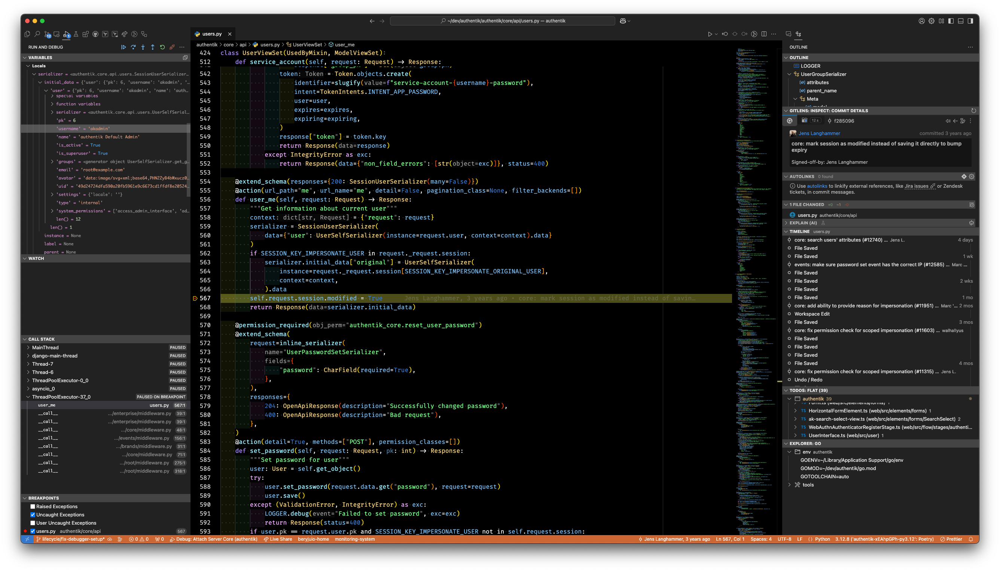

This page describes how to debug different parts of an authentik instance, running either in production or in a development setup.

## authentik Server & Worker - Python

The majority of the authentik codebase is in Python, running in gunicorn for the server and celery for the worker. These instructions show how this code can be debugged/inspected.

Note that authentik uses [debugpy](https://github.com/microsoft/debugpy), which relies on the "Debug Adapter Protocol". These instructions demonstrate debugging using [Visual Studio Code](https://code.visualstudio.com/), however they should be adaptable to other editors which support DAP.

To enable the debugging server, set the environment variable `AUTHENTIK_DEBUG` to `true`. This will by default launch the debugging server on port 9901.

With this setup in place, you can set Breakpoints in VS Code. To connect to the debugging server, run the command `> Debug: Start Debugging" in VS Code.

:::info
Note that due to the Python debugger for VS Code, when a python file in authentik is saved and the Django process restarts, you must manually reconnect the Debug session. Automatic re-connection is not supported for the Python debugger (see [here](https://github.com/microsoft/vscode-python/issues/19998) and [here](https://github.com/microsoft/vscode-python/issues/1182))
:::
